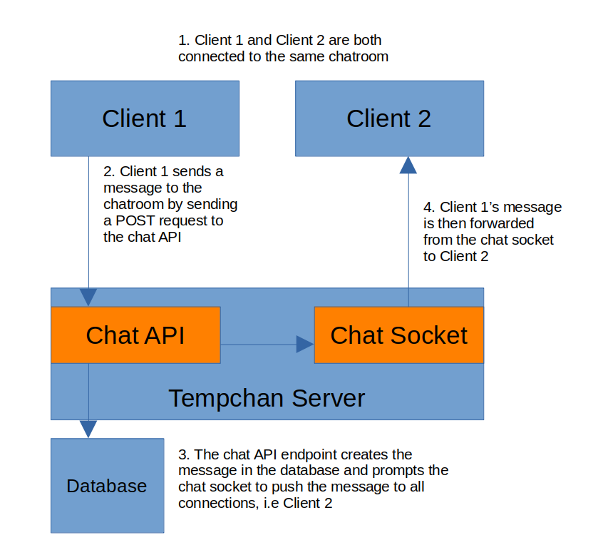

# Tempchan
This repo serves as the home for a lightweight livechat service inspired by the [kotchan](https://github.com/cnsr/kotchan/tree/kotchan) and [livechan](https://github.com/emgram769/livechan-js) projects. The goal of this project is to provide a basic, yet easily maintainable and extendable template that may serve as the foundation of a more ambitious, feature rich project.

## Running
### Prerequisites:

- nodejs/npm

### Create a config file

Create a file named `config.ts` in the base of the repo. This file is responsible for specifying various environment variables used in the server, such as the port the server runs on. See [example_config.ts](./example_config.ts) for an example of how this file should be structured.

### Create image directories

Create the following empty directories. These will be where images and their thumbnails are stored, respectively:
- `./public/tmp/uploads`
- `./public/tmp/thumb`

### Install the necesarry packages:

`npm i`

### Start the server:

`npm run start`

### Personalization:

For the sake of being lightweight, Tempchan on its own does not carry along any sort of custom banners, stickers, flags, icons etc. These are for server admins to add as they use Tempchan for their own purposes. As such, the following is a guide for several personalization options:

#### Boards

You can add / remove the boards offered by the server by the following steps:

- Set the `boards` array properly in your `config.js` file, with the array populated with the list of desired board names
- In [index.html](./src/pages/index.html), add additional board options to the `board_select` select html element, matching the list of boards specified in your config file.

#### Stickers

Stickers are custom images that users may add to chat messages, similar to discord stickers. To add stickers to your server, first add the sticker image to [the stickers directory](./public/images/stickers/). Then add the filename of the image to the `stickers` array in [sticker_list.js](./public/js/sticker_list.js).

- Ex: Adding `sticker.jpeg`
  - Place `sticker.jpeg` in `./public/images/stickers`
  - Updated `sticker_list.js`:
  ```
  stickers = [ ... , 'sticker.jpeg' ];
  ```

#### Banners

Banners are custom images that are randomly displayed to users who are currently in a chat room. Adding banners is a similar process to adding stickers: First add the banner image to [the banners directory](./public/images/banners/). Then add the filename of the image to the `banners` array in [banners.js](./public/js/banners.js).

- Ex: Adding `banner.jpeg`
  - Place `banner.jpeg` in `./public/images/banners`
  - Updated `banners.js`:
  ```
  banners = [ ... , 'banner.jpeg' ];
  ```

#### Tripflags

Tripflags can also be added/customized. Instructions can be found in [tripflags.js](./public/js/tripflags.js).

#### Custom Client

At the end of the day, as long as the api endpoints are hooked up properly, the frontend client can be completely custom and purpose built to your use case. As such, the entire `/public` directory can be scrapped and replaced with whatever you so choose, as the core functionality of the application is religated to the server.

## Current Design Overview

The following diagram details the overall architecture of the chat messaging system.



The implementation details surrounding the chat api endpoints and socket interface can be found in [chat.md](./docs/chat.md). The only aspect of this diagram not documented yet is the frontend client. Kotchan's frontend has been salvaged and cleaned up to serve as our frontend.

Additionally, more in depth details surrounding the middleware used in the security and preprocessing of client requests is not shown in this diagram. For a more indepth look into how the end points handle security and request processing, see the [middleware directory](./src/middleware/).

## Further work

This is a very simple and lightweight live chat service, as such there remains much to be desired in the way of feature richness, security, etc. The following are features that many admins may want to add in the future, and can hopefully be easily built on top of the already existing infrastructure:

- Admin commands
- Proxy detection and filtering
- Audio messages